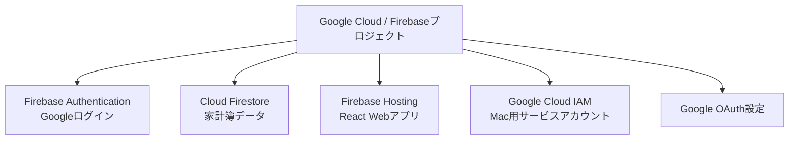
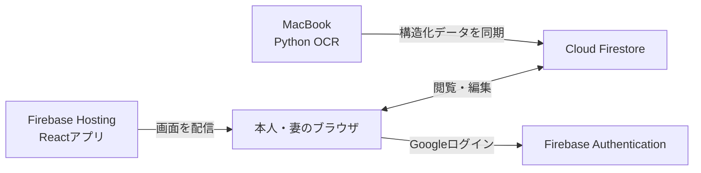

# はじめてのFirebase — receipt-ocr家計簿向け解説

このドキュメントは、Firebaseを初めて使う人向けに、サービスの仕組みと
`receipt-ocr` 家計簿での使い方を説明します。実際の画面操作とコマンドは
[`FIREBASE_SETUP.md`](./FIREBASE_SETUP.md)を参照してください。

## 最初に結論

### Google Cloudのプロジェクトと連動している？

**はい。Firebaseプロジェクトの実体はGoogle Cloudプロジェクトです。**

Firebase Consoleで新しいFirebaseプロジェクトを作成すると、裏側にGoogle Cloud
プロジェクトも作成されます。反対に、既存のGoogle CloudプロジェクトへFirebaseを
追加することもできます。

Firebase ConsoleとGoogle Cloud Consoleは、同じプロジェクトを別の目的で操作する
管理画面だと考えると分かりやすいです。

| 管理画面 | 主に扱うもの |
|---|---|
| Firebase Console | Authentication、Firestore、Hosting、Firebaseアプリ設定 |
| Google Cloud Console | IAM、サービスアカウント、API、OAuth、請求設定、詳細な割当量 |

公式ドキュメントにも、Firebaseプロジェクト作成時は背後でGoogle Cloudプロジェクトを
作成すると明記されています。

- [FirebaseプロジェクトとGoogle Cloudの関係](https://firebase.google.com/docs/projects/learn-more#relationship_between_firebase_projects_and_google_cloud)

### NoSQLなの？

**はい。今回使うCloud Firestoreはドキュメント指向のNoSQLデータベースです。**

SQLの「テーブル・行」の代わりに、Firestoreでは「コレクション・ドキュメント」を
使います。ドキュメントはJSONに近いKey-Valueデータです。

- SQL: `transactions` テーブルの1行
- Firestore: `transactions` コレクションの1ドキュメント

FirestoreにはSQLのJOINや外部キー制約はありません。その代わり、画面で必要な情報を
1つのドキュメントへまとめて保存します。公式の説明は以下です。

- [Cloud Firestoreのデータモデル](https://firebase.google.com/docs/firestore/data-model?hl=ja)

### Webホスティングできるの？

**できます。今回のReactアプリはFirebase Hostingへ配置します。**

Firebase Hostingは静的サイトとSPA（Single Page Application）向けのホスティングです。
公開すると、次のようなURLが発行されます。

```text
https://<project-id>.web.app
```

SSL証明書とHTTPS、世界各地のCDN、圧縮配信が標準で含まれます。独自ドメインも設定可能です。

- [Firebase Hosting公式ドキュメント](https://firebase.google.com/docs/hosting)

## FirebaseとGoogle Cloudの関係

今回使うリソースは、すべて1つのGoogle Cloudプロジェクトに所属します。



Firebase専用の別クラウドが存在するわけではありません。FirebaseはGoogle Cloudの機能を、
Web・Androidアプリ開発向けに使いやすくまとめたものです。

### 既存のGoogle Cloudプロジェクトを使うべきか

このリポジトリのAndroid撮影アプリは、Google Drive APIとOAuthのため、すでにGoogle Cloud
プロジェクトを使用しています。

そのプロジェクトが **receipt-ocr専用** なら、同じプロジェクトへFirebaseを追加する方針を
推奨します。

利点:

- OAuth同意画面や管理者をまとめられる
- Androidアプリと家計簿Webを同じ製品として管理できる
- プロジェクトや認証情報の取り違えが減る

一方、そのGoogle Cloudプロジェクトを他のアプリでも共用している場合は、Firebase家計簿用に
新規プロジェクトを作る方が安全です。Firestoreのデータ、IAM、無料枠、削除操作を分離できます。

Firebaseと既存プロジェクトは自動的には連動しません。Firebase Consoleでプロジェクトを追加する
際に、既存Google Cloudプロジェクトを明示的に選びます。

## 今回使うFirebase機能

### 1. Firebase Authentication

本人と妻が、それぞれのGoogleアカウントでログインするために使います。

Authenticationが確認するのは「誰がログインしているか」です。ログインできることと、家計簿を
閲覧できることは別です。Firestore Security Rulesがメールアドレスの許可リストを確認し、
許可された家族だけにデータアクセスを認めます。

```text
Googleログイン成功
  ↓
ログインユーザーのメールアドレスを取得
  ↓
Firestoreの許可リストを確認
  ↓
許可あり: 家計簿を表示
許可なし: データアクセス拒否
```

### 2. Cloud Firestore

家計簿の正式データを保存します。

今回の主な構造は以下です。

```text
households
└── hirata-household
    ├── allowed_emails    本人・妻の許可メール
    ├── receipts          レシート情報と確認状態
    ├── transactions      収入・支出・OCR明細
    ├── budgets           月別カテゴリ予算
    ├── categories        大・小カテゴリ
    └── category_rules    商品名からカテゴリへの分類ルール
```

取引ドキュメントの例:

```json
{
  "type": "expense",
  "amount": 198,
  "date": "2026-06-20",
  "majorCategory": "食費",
  "minorCategory": "食料品",
  "itemName": "おにぎり",
  "payer": "me",
  "shopName": "AEON",
  "source": "ocr",
  "receiptStatus": "confirmed"
}
```

SQLのようにレシートと店舗テーブルを毎回JOINせず、一覧や集計に必要な店名・支払者・日付も
取引ドキュメントへ保存しています。これはFirestoreで一般的な非正規化です。

### 3. Firebase Hosting

HostingにはReactをビルドしたHTML・CSS・JavaScriptだけを配置します。

Macで動かしているPython OCRプログラムをHosting上で実行するわけではありません。
Hostingは家計簿の画面を配信し、その画面がブラウザからAuthenticationとFirestoreへ接続します。



このためMacBookが電源OFFでも、すでに同期済みの家計簿データは外出先から閲覧・編集できます。
新しいレシートのOCRとクラウド同期だけはMacBook起動時に行います。

## なぜPythonのWebサーバーをクラウドへ置かないのか

今回のWebアプリは、ブラウザからFirebaseへ直接接続します。

独自Pythonサーバーをクラウドで常時動かす構成にすると、Cloud Run等の追加サービス、認証処理、
デプロイ、監視が必要になります。Firebase SDKとSecurity Rulesを使うことで、家庭向けアプリに
必要な構成を小さくしています。

Macの同期処理だけは管理権限が必要なため、サービスアカウントを使ってFirestoreへ接続します。

## NoSQLで家計簿集計は問題ないか

この家計簿の規模なら問題ありません。

月次ダッシュボードでは、対象月の確定済み取引をFirestoreから取得し、ブラウザ上で以下を計算します。

- 収入合計
- 支出合計
- 収支
- カテゴリ別支出
- 日別支出
- 予算に対する進捗

家庭用途では1か月の取引数が数百〜数千件程度なので、SQLサーバーで集計する必要はありません。
将来、複数年をまたぐ高度な分析や大量ユーザー対応が必要になった場合は、BigQuery連携やSQL系DBへの
移行を検討します。

## Hostingを公開するとデータも公開される？

**公開されません。**

Hosting上のHTML・CSS・JavaScriptは誰でも取得できます。これは通常のWebアプリと同じです。
ただし、Firestoreの家計データはSecurity Rulesで保護します。

ブラウザに設定する次の値は、秘密鍵ではありません。

```text
VITE_FIREBASE_API_KEY
VITE_FIREBASE_PROJECT_ID
VITE_FIREBASE_APP_ID
```

これらは「どのFirebaseプロジェクトへ接続するか」を示す公開識別子です。APIキーを知っているだけでは
家計データを読めません。AuthenticationとSecurity Rulesの両方を通過する必要があります。

一方、Macで使う次のファイルは強い管理権限を持つため、絶対に公開してはいけません。

```text
secrets/firebase-service-account.json
```

このリポジトリでは `secrets/` を `.gitignore` に登録済みです。

## 無料運用について

Sparkプランは支払い情報なしで開始でき、FirestoreとHostingには無料利用枠があります。Blazeへ変更すると、
基盤となるGoogle CloudプロジェクトへCloud Billingアカウントをリンクする形になります。

- [Firebase料金プランの説明](https://firebase.google.com/docs/projects/billing/firebase-pricing-plans?hl=ja)
- [Firebase料金表](https://firebase.google.com/pricing)

今回の構成では以下を守ります。

- Sparkプランのまま使う
- Google Cloud Billingアカウントをリンクしない
- レシート画像とOCR全文をFirestoreへ保存しない
- Cloud FunctionsやCloud Runを使わない
- 本人・妻の2人だけで利用する

Firestoreの無料枠は保存1GiB、1日50,000読取、20,000書込です。Hostingも静的ファイル保存と
転送量に無料枠があります。家庭用家計簿では十分な規模です。

- [Firestoreの無料割当量](https://firebase.google.com/docs/firestore/quotas#free_quota)
- [Firebase Hostingの機能と無料枠](https://firebase.google.com/products/hosting)

Sparkプランでは無料枠を超えて自動課金されるのではなく、そのサービスが利用制限されます。
継続利用できなくなった場合も、明示的にBlazeへ変更しない限り従量課金にはなりません。

## SQLiteとの役割分担

Firestoreへ移行しても、MacのSQLiteは削除しません。

| 保存先 | 役割 |
|---|---|
| SQLite | OCR原文、ローカル処理履歴、未同期・同期失敗、再送管理 |
| Firestore | 確定した家計簿、Webでの修正、予算、カテゴリ、共有データ |

Firestoreを家計簿の正本とします。Webで修正済みの値を、古いSQLiteデータで上書きしない設計です。

## 管理画面で混乱しやすい用語

| 用語 | 意味 |
|---|---|
| Firebaseプロジェクト | Google Cloudプロジェクトと1対1で対応する管理単位 |
| Firebase App | プロジェクトへ登録したWeb・Android・iOSアプリの設定 |
| Project ID | URLやAPIで使う変更できない識別子 |
| Web API Key | Webアプリ用の公開識別子。サービスアカウント鍵とは別物 |
| Firestore | 家計簿データを保存するNoSQLデータベース |
| Authentication | Googleログイン等を提供する認証サービス |
| Hosting | Reactのビルド結果を配信するWebホスティング |
| Security Rules | ブラウザからFirestoreへアクセスできる条件 |
| サービスアカウント | Macの同期処理など、サーバー側プログラム用の認証情報 |
| Spark | 支払い情報不要の無料プラン |
| Blaze | Google Cloud Billingと連携する従量課金プラン |

## 今回の構成で発生しないこと

- Firebaseへレシート画像をアップロードしない
- OCR処理をGoogle Cloud上で実行しない
- MacBookをWebサーバーとして外部公開しない
- 妻とパスワードを共有しない
- 許可されていないGoogleアカウントへ家計データを公開しない
- SparkからBlazeへ自動的に変更されない

## 次に読むドキュメント

仕組みを理解したら、[`FIREBASE_SETUP.md`](./FIREBASE_SETUP.md)に沿って次の順番で設定します。

1. 既存Google CloudプロジェクトをFirebaseへ追加する
2. Google Authenticationを有効にする
3. Firestoreを東京リージョンで作成する
4. Mac用サービスアカウント鍵を配置する
5. 本人・妻のメールアドレスを許可リストへ登録する
6. Security RulesとWebアプリをデプロイする
7. 既存SQLiteデータを確認待ちとして移行する
